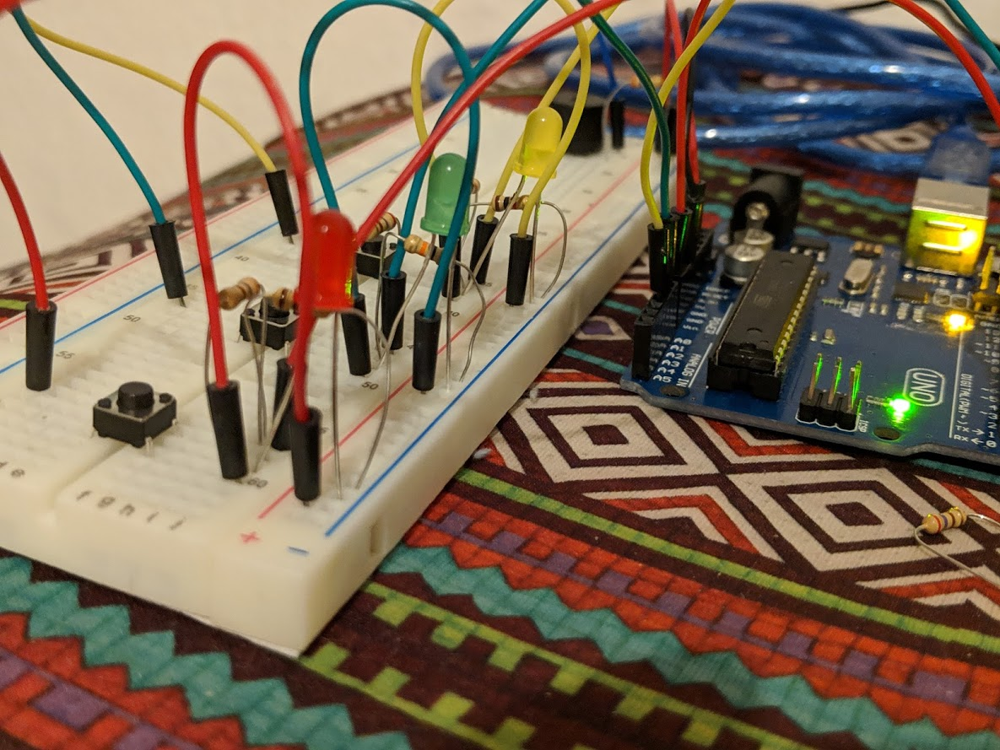
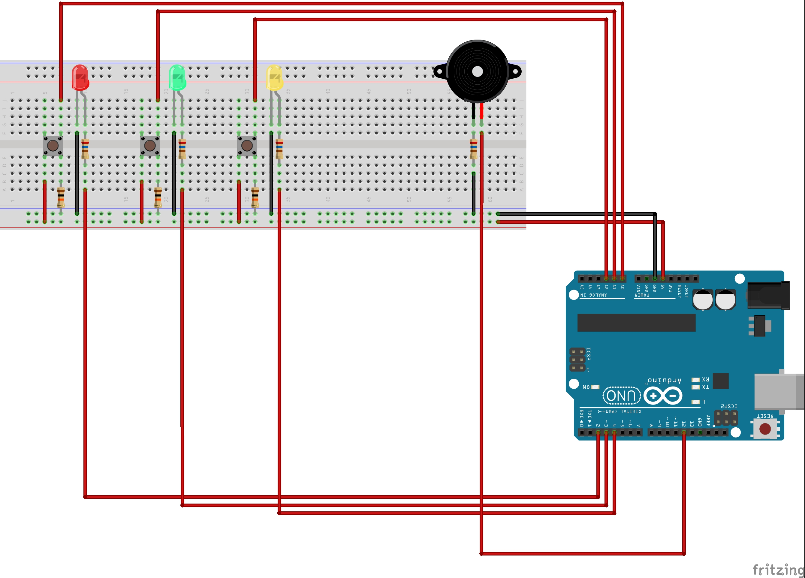

# Arduino Simon Says

A simple game of **Simon Says** built with the Arduino. You can see it in action [here](https://www.youtube.com/watch?v=V3KuRGsI_0s).

## Getting Started

You have to have the **Arduino IDE** installed in order to run this project. See below.

## Prerequisites

* [Arduino IDE](https://www.arduino.cc/en/Main/Software)
* [Fritzing](http://fritzing.org/home/) if you want to edit schematics

## Bill of Materials

* 1x Arduino UNO
* 3x 10kΩ Resistor
* 4x 260Ω Resistor
* 3x LED
* 3x Push Button
* 1x Piezo Speaker
* Male-Male Jumper Cables

## Schematics

You can view the schematics [here](simon-says_schem.pdf).

## License

This project is licensed under the MIT License - see the [LICENSE.md](LICENSE.md) file for details.

---

💻✨ Code wizardry by **João Gomes** ([@jlfgms](https://www.twitter.com/jlfgms))